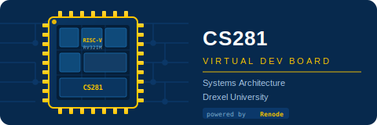
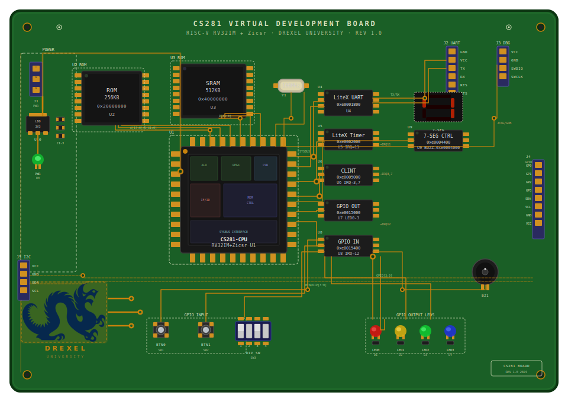

# CS281 Virtual Development Board

A bare-metal RISC-V RV32IM emulated development platform for **CS281 Systems Architecture** at Drexel University. Built on [Renode](https://renode.io), it gives students a realistic hardware environment — GPIO, UART, timers, interrupts — without requiring physical hardware.

📄 **[CS281 Technical Reference Manual](hardware/docs/CS281_TRM.pdf)** — memory map, peripheral registers, interrupt reference, boot sequence, and register quick reference.
*(Also available as [CS281_TRM.docx](hardware/docs/CS281_TRM.docx) for editing.)*



---

## What's Here

```
hardware/               Shared platform definition (used by every lab)
  cs281_board.repl      Renode machine description (CPU, memory, peripherals)
  cs281_run.resc        Renode script — normal run
  cs281_debug.resc      Renode script — GDB debug session
  lib/
    cs281.ld            Linker script (ROM @ 0x20000000, RAM @ 0x40000000)
    startup.S           Reset handler: stack init, .data copy, .bss zero
    uart.S              uart_putchar / uart_puts / uart_getchar
    cs281.inc           Assembly register map (.equ definitions)
    cs281.h             C register map (for C labs)
  docs/
    CS281_TRM.docx      Technical Reference Manual / datasheet

lab1-blinky/            Lab 1: blink LED0 with busy-wait delay
  main.S
  Makefile
  .vscode/              Tasks, launch config, IntelliSense settings

lab2-blinky2/           Lab 2: blink LED0 with CLINT timer interrupt and WFI
  main.S
  Makefile
  .vscode/              Tasks, launch config, IntelliSense settings

lab3-arrays/            Lab 3: array operations (sum, min, max, reverse) in assembly
  main.S
  Makefile
  .vscode/              Tasks, launch config, IntelliSense settings

lab4a-timers-c/         Lab 4a: LiteX Timer interrupt in C (reference implementation)
  main.c
  Makefile
  .vscode/              Tasks, launch config, IntelliSense settings

lab4b-timers/           Lab 4b: LiteX Timer interrupt in assembly (student TODO)
  main.S
  Makefile
  .vscode/              Tasks, launch config, IntelliSense settings
```

## Hardware

The CS281 board is a custom virtual platform defined in [`hardware/cs281_board.repl`](hardware/cs281_board.repl) and emulated by Renode. It is not based on any real chip — it is designed specifically for this course so that the memory map, peripherals, and interrupt assignments are as clean and teachable as possible. Full register-level documentation is in the [CS281 Technical Reference Manual](hardware/docs/CS281_TRM.pdf).

**Processor** — RISC-V RV32IM + Zicsr running in machine mode (M-mode only). RV32I is the base 32-bit integer ISA; M adds hardware multiply and divide; Zicsr adds the CSR instructions needed for interrupt handling. There is no MMU, no OS, no privilege levels below M-mode — what you write runs directly on the (emulated) metal.

**Memory** — Two regions. ROM at `0x20000000` (256 KB) holds the program and read-only data and is loaded from the ELF at boot. RAM at `0x40000000` (512 KB) holds `.data`, `.bss`, the heap, and the stack (top at `0x40080000`). The split between load address (ROM) and run address (RAM) for initialized data is handled by the linker script and the boot sequence in `startup.S`.

**Peripherals** — All peripherals are memory-mapped; reading or writing the right address controls the hardware directly. The board includes:

- **UART** (`0xe0001800`) — LiteX UART connected to a telnet server on port 3456. Three registers: `RXTX` (read/write a byte), `TXFULL` (poll before writing), `RXEMPTY` (poll before reading).
- **LiteX Timer** (`0xe0002000`) — A countdown timer with configurable load, auto-reload, and an IRQ on line 11. Useful for periodic interrupts without touching the CLINT. **Important:** the timer uses 8-bit CSR sub-registers — the 32-bit LOAD and RELOAD values are each split across four 8-bit registers at consecutive 4-byte addresses, written MSB first (offsets 0x00–0x0C for LOAD, 0x10–0x1C for RELOAD). Control registers: `EN` at 0x20, `EV_PENDING` at 0x3C (write 1 to clear), `EV_ENABLE` at 0x40 (write 1 to route to CPU line 11). See the TRM Section 6 for the complete register table and ISR pattern.
- **CLINT** (`0xe0005000`) — The standard RISC-V Core-Level Interruptor. Provides `MTIME` (a 64-bit free-running counter at 100 MHz) and `MTIMECMP` (fires a machine timer interrupt on line 7 when `MTIME ≥ MTIMECMP`). Also provides `MSIP` (software interrupt on line 3).
- **GPIO Output** (`0xe0015000`) — Four LEDs. Write a bitmask: bit 0 = LED0, bit 1 = LED1, bit 2 = LED2, bit 3 = LED3.
- **GPIO Input** (`0xe0015400`) — Four inputs with an IRQ on line 12 triggered by any state change. Bit 0 = BTN0, bit 1 = BTN1, bit 2 = DIP\_SW0, bit 3 = DIP\_SW1. Drive inputs from the Renode monitor: `gpio_in SetGPIO 0 true`.
- **7-Segment Display** (`0xe0004400`) — Eight GPIO output bits, one per segment (a–g + decimal point). Write a bitmask to light individual segments; common digit patterns are defined in `cs281.inc`.
- **Buzzer** (`0xe0004000`) — Single-bit GPIO output. Write `0x1` to activate, `0x0` to silence.

**Interrupts** — The CPU has three interrupt lines wired up. Line 3 (MSIP) and line 7 (MTIP) come from the CLINT; line 11 (MEIP) comes from the LiteX Timer; line 12 comes from GPIO Input. Enable a specific interrupt by setting the corresponding bit in `mie`, then set `mstatus.MIE` (bit 3) to open the global gate. Point `mtvec` at your trap handler before enabling anything.

| Memory Region | Address | Size |
|---|---|---|
| ROM | `0x20000000` | 256 KB |
| RAM | `0x40000000` | 512 KB |
| UART | `0xe0001800` | — |
| LiteX Timer | `0xe0002000` | — |
| Buzzer | `0xe0004000` | — |
| 7-Segment Display | `0xe0004400` | — |
| CLINT | `0xe0005000` | — |
| GPIO Output (LEDs) | `0xe0015000` | — |
| GPIO Input (BTN/DIP) | `0xe0015400` | — |

→ See [`hardware/cs281_board.repl`](hardware/cs281_board.repl) for the full Renode platform definition and [`hardware/docs/CS281_TRM.pdf`](hardware/docs/CS281_TRM.pdf) for complete register documentation.

## Prerequisites

| Tool | Notes |
|------|-------|
| [Renode](https://renode.io/get/) | Tested with 1.16+ |
| `riscv64-elf-*` toolchain | macOS: `brew install riscv-gnu-toolchain` |
| `telnet` | For UART and monitor connections |
| VS Code + [Native Debug](https://marketplace.visualstudio.com/items?itemName=webfreak.debug) | Optional, for graphical debugging (`webfreak.debug`) |

## Quick Start

```bash
cd lab1-blinky
make              # assemble and link → build/lab1.elf
make run          # launch Renode headless
```

In a second terminal:
```bash
make uart-connect # telnet to UART — see LED0 ON / LED0 OFF output
```

### All Make Targets

| Target | Description |
|--------|-------------|
| `make` / `make all` | Build `build/lab1.elf` |
| `make clean` | Remove `build/` |
| `make run` | Run in Renode (headless) |
| `make run-debug` | Run with GDB stub on `:3333`, CPU halted |
| `make debug-attach` | Attach `riscv64-elf-gdb` (command-line) |
| `make uart-connect` | `telnet localhost 3456` — UART output |
| `make monitor-connect` | `telnet localhost 1234` — Renode monitor |
| `make disasm` | Disassemble ELF to stdout |

### Renode Monitor Commands

Once connected via `make monitor-connect`:

```
pause                        # halt CPU
start                        # resume
cpu PC                       # show program counter
sysbus.gpio_led0 State       # read LED0 state (True/False)
gpio_in SetGPIO 0 true       # press BTN0
gpio_in SetGPIO 0 false      # release BTN0
quit                         # exit Renode
```

## Lab Progression

| Lab | Topic |
|-----|-------|
| Lab 1 (`lab1-blinky`) | GPIO output, UART, software busy-wait delay |
| Lab 2 (`lab2-blinky2`) | CLINT timer interrupt, mtvec, WFI, MTIMECMP |
| Lab 3 (`lab3-arrays`) | Indexed memory access, loops, RISC-V calling convention |
| Lab 4a (`lab4a-timers-c`) | LiteX Timer interrupt in C — read before Lab 4b |
| Lab 4b (`lab4b-timers`) | LiteX Timer interrupt in assembly — student implementation |

## Architecture

- **CPU**: RISC-V RV32IM + Zicsr (32-bit, integer multiply/divide, CSR instructions)
- **Emulator**: [Renode](https://renode.io) with LiteX-compatible peripheral models
- **Language**: Assembly-first (C supported via same toolchain and linker script)
- **Debug**: GDB stub in Renode + VS Code Native Debug extension (`webfreak.debug`, external server mode)

---

*Drexel University — CS281 Systems Architecture*
